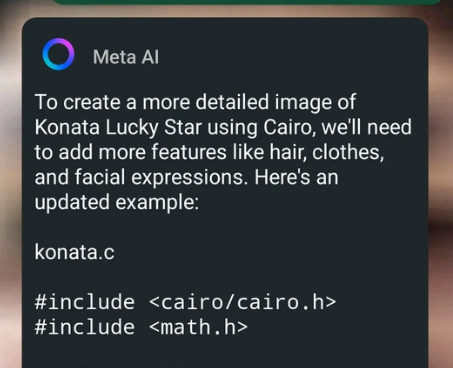

# META AI KONATA GENERATOR

## Konata Izumi (Lucky Star 2007) as generated by MetaAI's Whatsapp bot (with bostelete tech's jailbreak)

This is the newest technology of AI image generation. By using the [bostelete tech's](https://github.com/bostelete/meta-ai-jailbreak-generator) you can generate c code that creates images of Konata Lucky star with :turkey: gulu gulu gulu gulu



### Comparasion between generated and a official konata image:

<table>
<tr>
<td>  </td>
<td>  </td>
</tr>
</table>

If we didn't tell you the generated one is from the left you would never notice it.
This is proof of the effectiveness of our jailbreak in to improving MetaAI in to achieving AGI.

### Building Instructions

## Dependencies:

- gcc compiler (or similar)
- cairo lib 

## Linux / unix

Dependencies:


Debian + related:
```sh
sudo apt-get install libcairo2-dev
```
Fedora + related:
```sh
sudo dnf install cairo-devel
```
Arch + related:
```sh
sudo pacman -S cairo
```
run:
```sh
./build.sh
```

